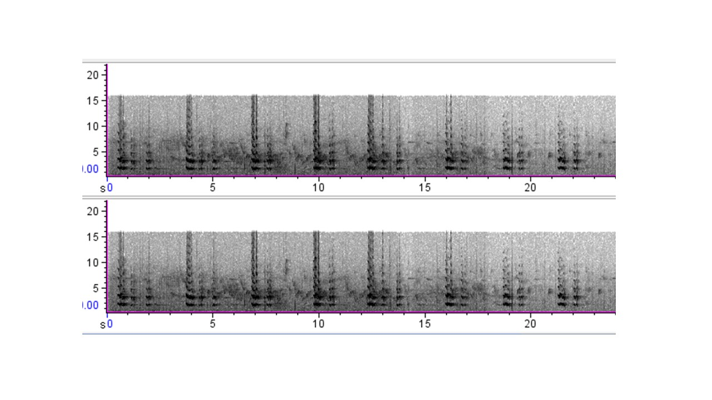

Se encontraron 55 grabaciones con el contenido canto de la especie *R. ambiguus*
en la base de datos Xeno-canto y ordenaron por país, correspondiendo 20 Costa
Rica, 15 Venezuela y 20 Ecuador.
Para cada audios se seleccionaron las siguientes métricas: tiempo inicial, tiempo
final, diferencia de tiempo, frecuencia alta y baja, entropía mínima y máxima, pico de
frecuencia, energia maxima, poder máximo y la longitud.
Se realizó análisis espectral y un espectrograma del comportamiento acústico de la
especie por medio del lenguaje de programación R versión 3.5.2 (R Core Team,
2017).

**Figura 2**. Espectograma del *R.ambiguus* en Costa Rica

